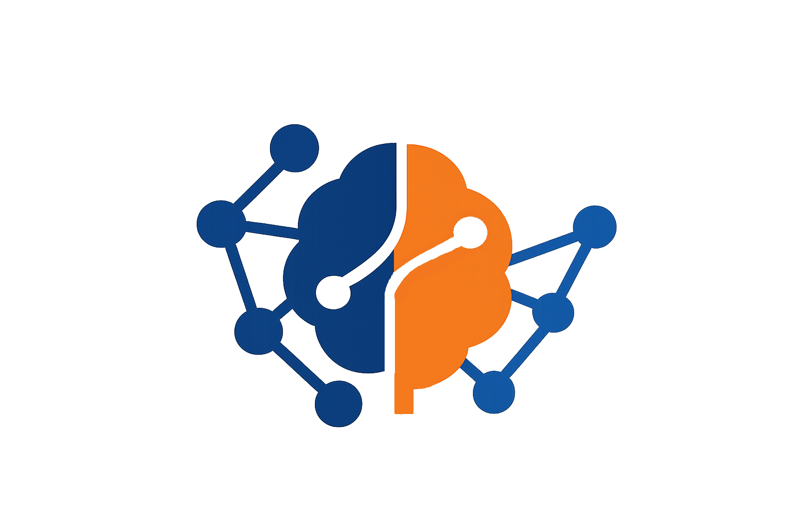

# NLPolitik

Sistema para análisis automatizado del discurso político en español.

## Características
- Preprocesamiento con extracción de oraciones contextuales
- Embeddings semánticos con SBERT
- Reducción dimensional con autoencoder 
- Clustering con K-Means, AGNES y DBSCAN
- Clasificación ideológica con SVM entrenado con MARPOR
- Detección de temas económicos con PLDA

## Tecnologías
Python 3.9, Flask, scikit-learn, TensorFlow, spaCy, Sentence-Transformers, MySQL

